# Extended Kalman Filter Project

In this project you will utilize a kalman filter to estimate the state of a moving object of interest with noisy lidar and radar measurements. Passing the project requires obtaining RMSE values that are lower that the tolerance outlined in the project rubric. 

The goals / steps of this project are the following:

* Step 1: Initializing kalman filter matrices and vectors 
* Step 2: Predicting state vector (px, py, vx, vy) and state covariance matrix 
* Step 3: Updating predicted states based on sensor measurements
* Step 4: Calculating rmse

Goals:
* Utilizing kalman filter to estimate the state of a moving object with lidar and radar mesaurments
* Achieving low RMSE values  

### Build & Run Instruction
This project involves the Term 2 Simulator which can be downloaded [here](https://github.com/udacity/self-driving-car-sim/releases)

This repository includes two files that can be used to set up and install [uWebSocketIO](https://github.com/uWebSockets/uWebSockets) for either Linux or Mac systems. For windows you can use either Docker, VMware, or even [Windows 10 Bash on Ubuntu](https://www.howtogeek.com/249966/how-to-install-and-use-the-linux-bash-shell-on-windows-10/) to install uWebSocketIO. 

Once the install for uWebSocketIO is complete, the main program can be built and run by doing the following from the project top directory.

1. Clone this repo.
2. Make a build directory: `mkdir build && cd build`
3. Compile: `cmake .. && make` 
   * On windows, you may need to run: `cmake .. -G "Unix Makefiles" && make`
4. Run it: `./ExtendedKF `

### Report

#### Data 1

RMSE Total:
<table style="width:100%">
  <tr>
    <td>px </td>
    <td>py </td>
    <td>vx </td>
    <td>vy </td>
  </tr>
  <tr>
    <td>0.0973</td>
    <td>0.0855</td>
    <td>0.4513</td>
    <td>0.4399</td>
  </tr>
</table>

RMSE Laser Only:
<table style="width:100%">
  <tr>
    <td>px </td>
    <td>py </td>
    <td>vx </td>
    <td>vy </td>
  </tr>
  <tr>
    <td>0.1222</td>
    <td>0.0984</td>
    <td>0.5825</td>
    <td>0.4567</td>
  </tr>
</table>

RMSE Radar Only:
<table style="width:100%">
  <tr>
    <td>px </td>
    <td>py </td>
    <td>vx </td>
    <td>vy </td>
  </tr>
  <tr>
    <td>0.1909</td>
    <td>0.2799</td>
    <td>0.4534</td>
    <td>0.6776</td>
  </tr>
</table>

<table style="width:100%">
  <tr>
    <td>RMSE Total</td>
    <td>RMSE Laser only</td>
    <td>RMSE Radar only</td>
  </tr>
  <tr>
    <td>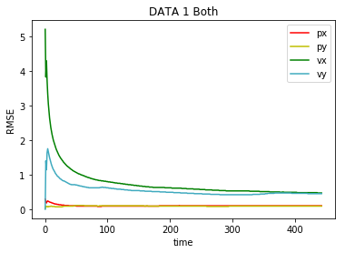</td>
    <td>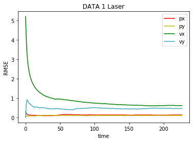</td>
    <td>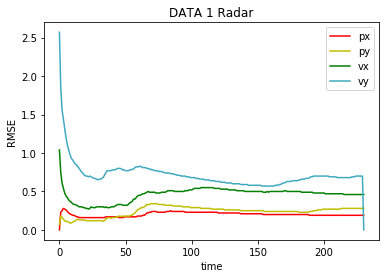</td>
  </tr>
  <tr>
<table>

<table style="width:100%">
  <tr>
    <td>Simulator Total</td>
    <td>Simulator Laser only</td>
    <td>Simulator Radar only</td>
  </tr>
  <tr>
    <td>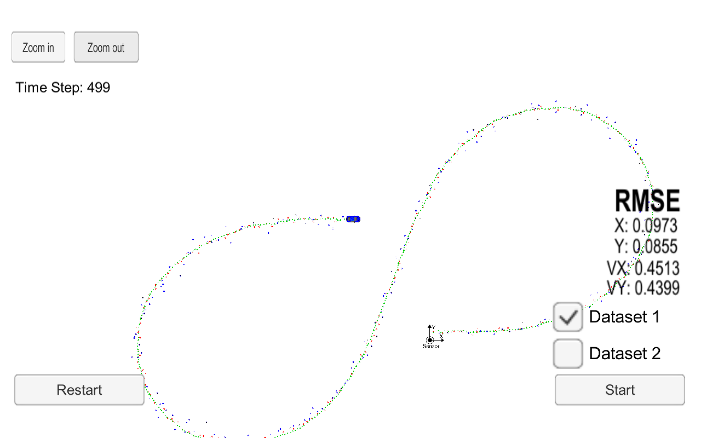</td>
    <td>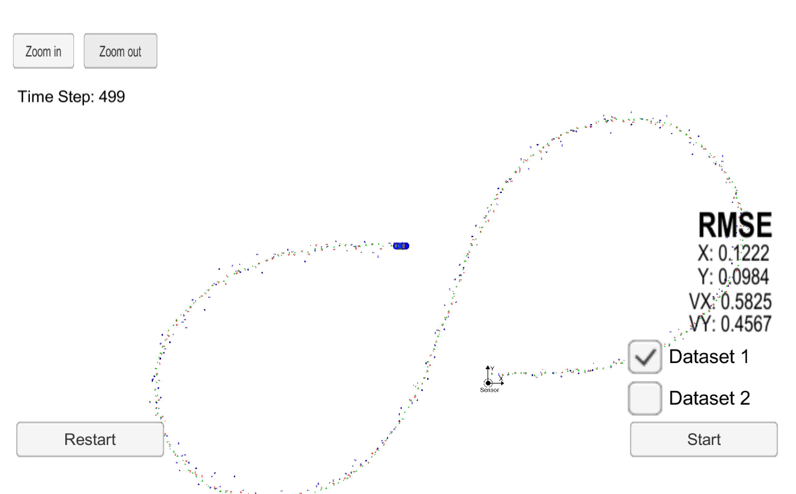</td>
    <td>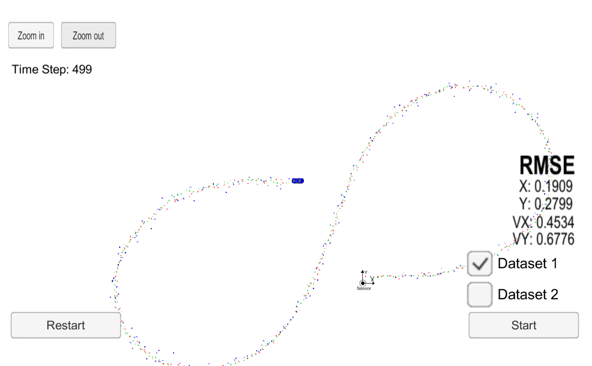</td>
  </tr>
  <tr>
<table>

#### Data 2

RMSE Total:
<table style="width:100%">
  <tr>
    <td>px </td>
    <td>py </td>
    <td>vx </td>
    <td>vy </td>
  </tr>
  <tr>
    <td>0.0726</td>
    <td>0.0965</td>
    <td>0.4216</td>
    <td>0.4932</td>
  </tr>
</table>

RMSE Laser Only:
<table style="width:100%">
  <tr>
    <td>px </td>
    <td>py </td>
    <td>vx </td>
    <td>vy </td>
  </tr>
  <tr>
    <td>0.0961</td>
    <td>0.1003</td>
    <td>0.5418</td>
    <td>0.4640</td>
  </tr>
</table>

RMSE Radar Only:
<table style="width:100%">
  <tr>
    <td>px </td>
    <td>py </td>
    <td>vx </td>
    <td>vy </td>
  </tr>
  <tr>
    <td>0.2256</td>
    <td>0.2959</td>
    <td>0.5879</td>
    <td>0.7966</td>
  </tr>
</table>

<table style="width:100%">
  <tr>
    <td>RMSE Total</td>
    <td>RMSE Laser only</td>
    <td>RMSE Radar only</td>
  </tr>
  <tr>
    <td>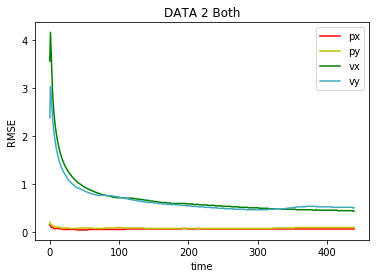</td>
    <td>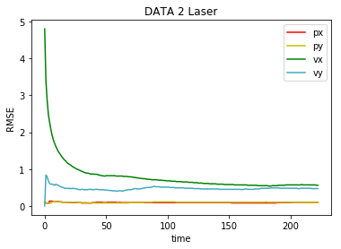</td>
    <td>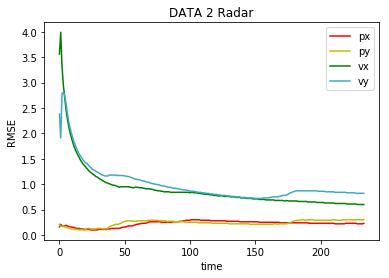</td>
  </tr>
  <tr>
<table>

<table style="width:100%">
  <tr>
    <td>Simulator Total</td>
    <td>Simulator Laser only</td>
    <td>Simulator Radar only</td>
  </tr>
  <tr>
    <td>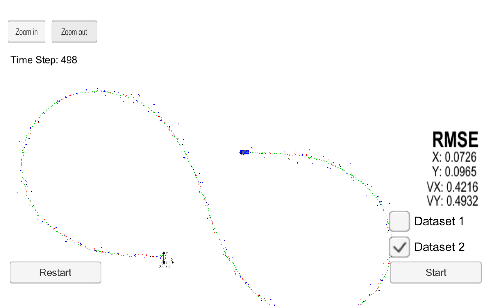</td>
    <td>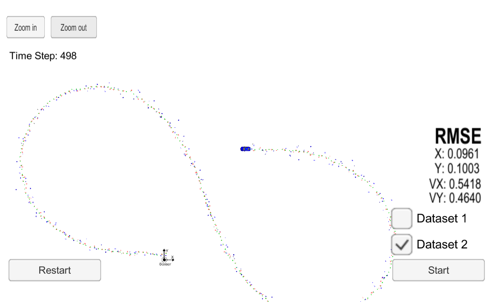</td>
    <td>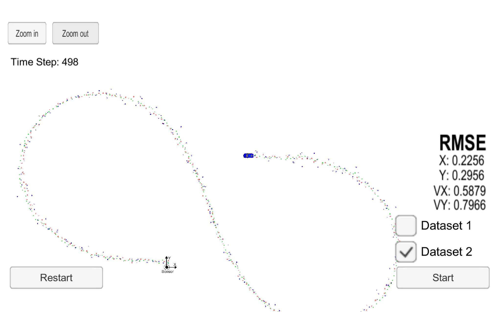</td>
  </tr>
  <tr>
<table>

According to the plots and avg RMSE values, considering both sensor information obviously generates more accurate results. However on both datasets LASER tends to be more precise than RADAR overall. 
But eliminating 1 sensor results in missing almost half of the data from simulator. (total number of data ~440, laser-only:~220 , radar-only:~220)
